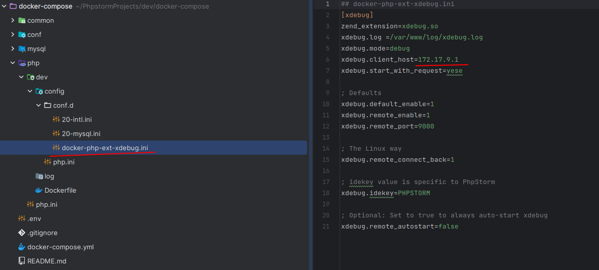
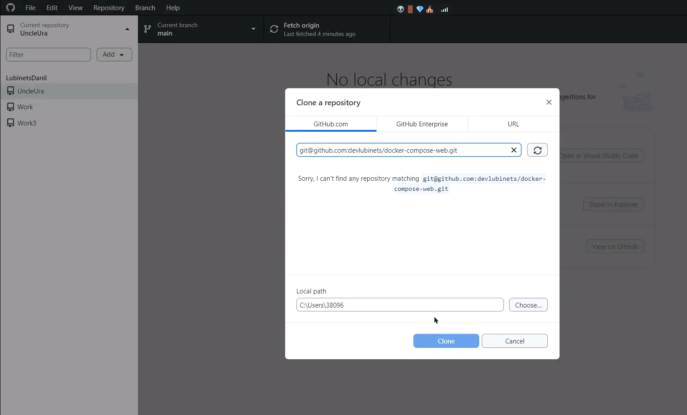

## Custom linux port

* Well-Known Ports: 0 – 1023
* Registered Ports: 1024 – 49151
* Dynamic and Private Ports: 49152 – 65535

https://en.wikipedia.org/wiki/List_of_TCP_and_UDP_port_numbers

## Xdebug setup

todo: add note screen get id for windows
todo: add note how setup IDE

Git desktop clone

todo: add script to auto change container name on php config